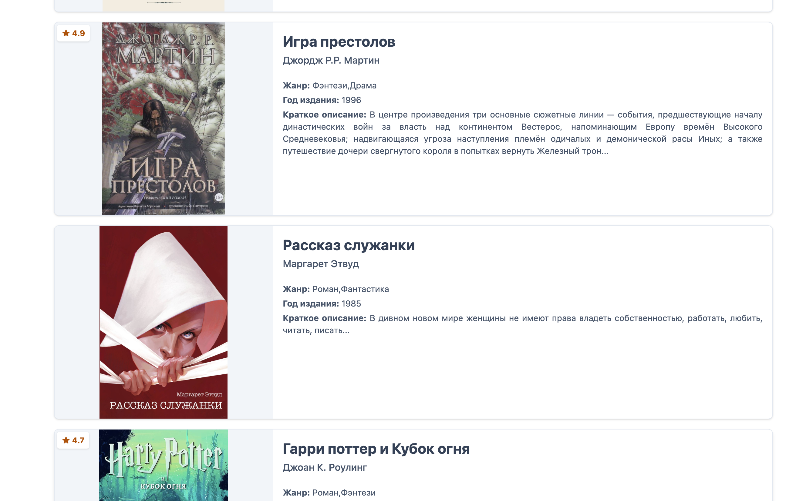

  
# Домашка №3

1. Для отображения описания книги создан компонент book-details-dialog
   
2. Добавлено пустое состояние для data-card и data-list (emptyState), созданы базовые layout в шаблонах data-card и data-list для карточки

3. Создана директива appIfHighRating для отоюоажения карточек с высоким рейтингом (больше 4.0)
   

