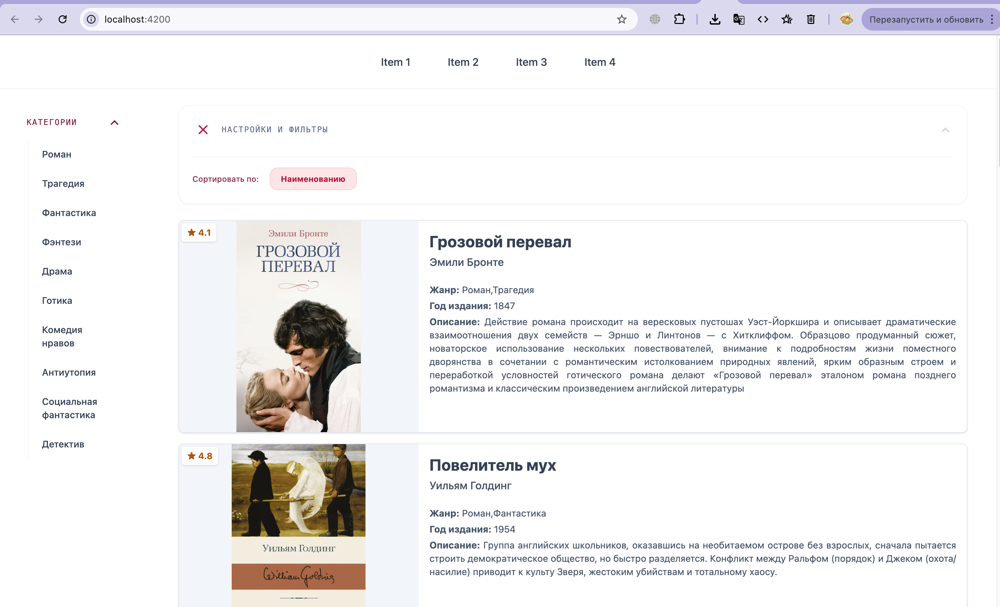
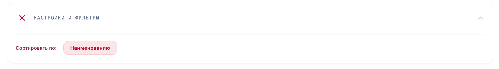
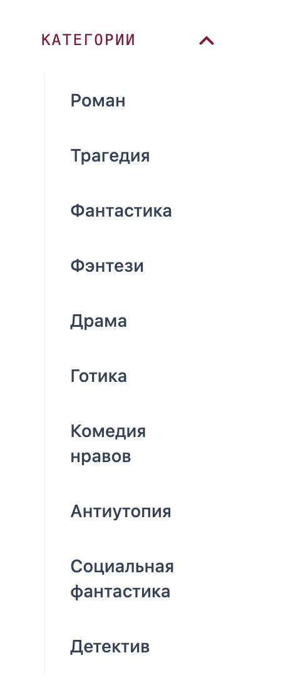

  
# Домашка №2

1. Для хранения набора данных создан mock-file: /src/app/mock-data/books.mock.ts. Данные типизированы (type Book в models)

2. Для отображения данных созданы компоненты: data-card, data-list.
   data-card - компонент для отрисовки детальной карточки книги;

   data-list - компонент для отрисовки списка карточек и панели для сортировки карточек;

3. и 4. Для сортировки по параметрам создан компонент setting-panel. Содержит внутри себя опции сортировки (для них создан type Option в models), которые добавляются из класса

5. Меню категорий реализовано как компонента left-menu (при необходимости можно подключить несколько меню)

