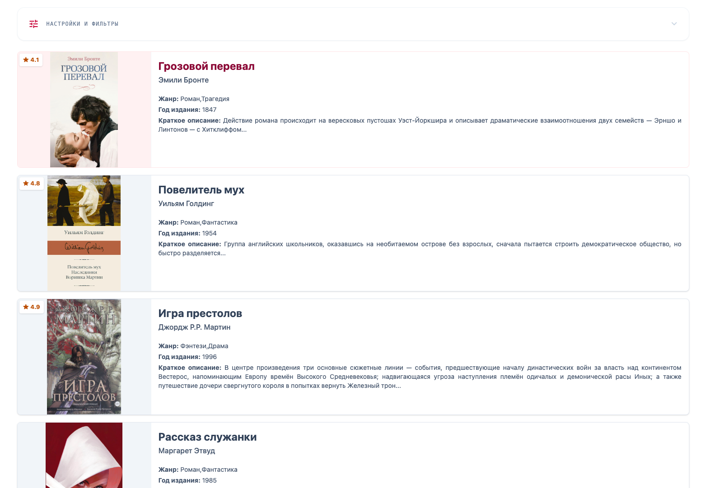
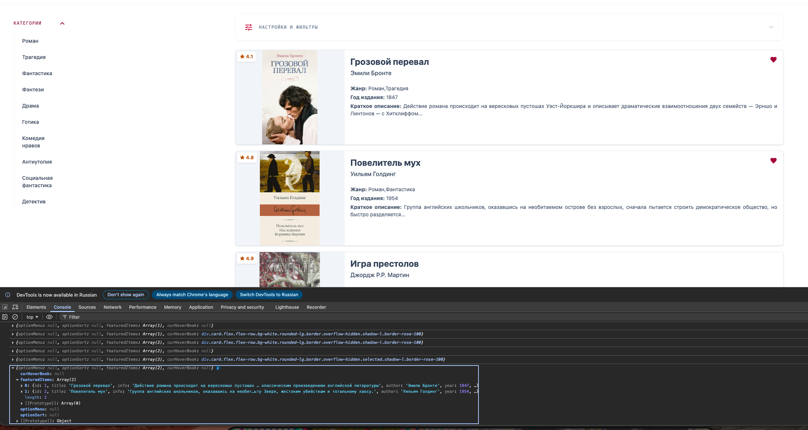
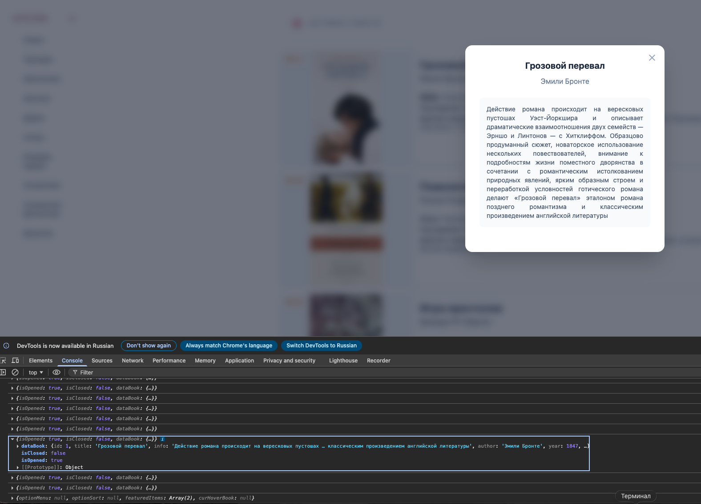

  
# Домашка №4

1. Для отслеживания наведения курсора на карточку создана директива hover-on-card.directive, при 1 клике на карточку - она помечается как избранная (добавление класса selected через директиву selected-card.directive), при 2 - открывается диалоговое окно с описанием. Для диалогового окна добавлена возможность закрытия при нажатии на Escape
   

2. Сервис для сортировки изменен в сервис для полного управления книгами в соотвественности с обязанностями из ДЗ (на скрине логи состояния потока из filter.service)
   

3. Создан сервис для управления диалоговым окном в соотвественности с обязанностями из ДЗ (на скрине логи состояния потока из dialog.service)
   

